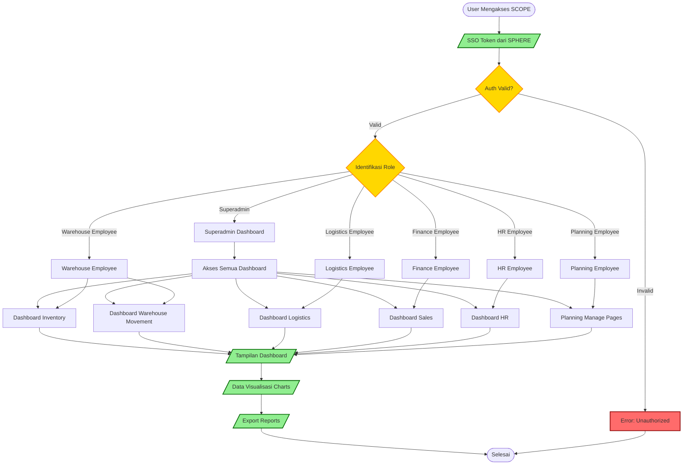
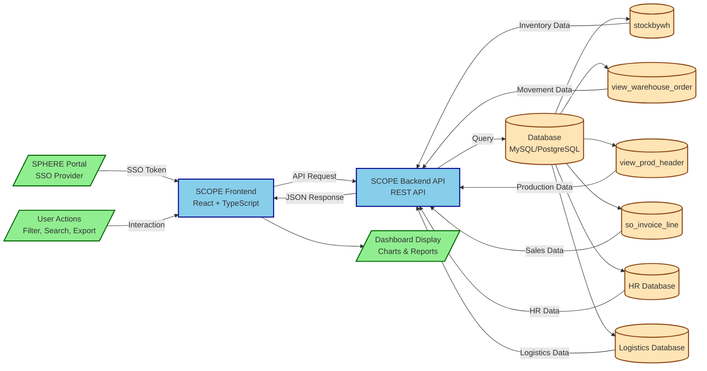

# SCOPE System Flowchart

## System Overview
SCOPE (Sanoh Comprehensive Operations Platform for Enterprise) adalah sistem dashboard multi-departemen yang terintegrasi dengan SPHERE (aplikasi portal superapp) melalui SSO authentication.

---

## Main System Flowchart

---

## Detailed Dashboard Access Flowchart

```mermaid
flowchart TD
    UserLogin[/User Login via SPHERE SSO/]
    
    %% Main Dashboard Selection
    DashboardMenu{Pilih Dashboard}
    
    %% Inventory Dashboard Detail
    InventoryMenu[Dashboard Inventory]
    InventoryOptions{Pilih Warehouse}
    InvAllRM[Inventory All RM]
    InvAllFG[Inventory All FG]
    InvWHRM01[Inventory WHRM01]
    InvWHRM02[Inventory WHRM02]
    InvWHFG01[Inventory WHFG01]
    InvWHFG02[Inventory WHFG02]
    InvWHMT01[Inventory WHMT01]
    
    %% Warehouse Dashboard Detail
    WarehouseMenu[Dashboard Warehouse]
    WarehouseOptions{Pilih Warehouse}
    WhAllRM[Warehouse All RM]
    WhAllFG[Warehouse All FG]
    WhWHRM01[Warehouse WHRM01]
    WhWHRM02[Warehouse WHRM02]
    WhWHFG01[Warehouse WHFG01]
    WhWHFG02[Warehouse WHFG02]
    WhWHMT01[Warehouse WHMT01]
    
    %% Production Dashboard Detail
    ProductionMenu[Dashboard Production]
    ProductionOptions{Pilih Divisi}
    ProdDashboard[Production Overview]
    ProdBZ[Production BZ]
    ProdCH[Production CH]
    ProdNL[Production NL]
    ProdPS[Production PS]
    ProdSC[Production SC]
    
    %% Sales Dashboard
    SalesMenu[Dashboard Sales]
    SalesCharts[/Sales Analytics Charts/]
    
    %% Logistics Dashboard
    LogisticsMenu[Dashboard Logistics]
    LogisticsCharts[/Logistics Performance Charts/]
    
    %% HR Dashboard
    HRMenu[Dashboard HR]
    HRCharts[/HR Analytics Charts/]
    
    %% Planning Manage
    PlanningMenu[Planning Manage]
    PlanningOptions{Pilih Fungsi}
    DailyUseUpload[Daily Use Upload]
    DailyUseManage[Daily Use Manage]
    ProdPlanUpload[Production Plan Upload]
    ProdPlanManage[Production Plan Manage]
    
    %% Output
    DisplayData[/Tampilkan Data & Charts/]
    ExportOption{Export Data?}
    ExportFile[/Download File Export/]
    Done([Selesai])
    
    %% Flow
    UserLogin --> DashboardMenu
    
    DashboardMenu -->|Inventory| InventoryMenu
    DashboardMenu -->|Warehouse| WarehouseMenu
    DashboardMenu -->|Production| ProductionMenu
    DashboardMenu -->|Sales| SalesMenu
    DashboardMenu -->|Logistics| LogisticsMenu
    DashboardMenu -->|HR| HRMenu
    DashboardMenu -->|Planning| PlanningMenu
    
    %% Inventory Flow
    InventoryMenu --> InventoryOptions
    InventoryOptions --> InvAllRM
    InventoryOptions --> InvAllFG
    InventoryOptions --> InvWHRM01
    InventoryOptions --> InvWHRM02
    InventoryOptions --> InvWHFG01
    InventoryOptions --> InvWHFG02
    InventoryOptions --> InvWHMT01
    
    %% Warehouse Flow
    WarehouseMenu --> WarehouseOptions
    WarehouseOptions --> WhAllRM
    WarehouseOptions --> WhAllFG
    WarehouseOptions --> WhWHRM01
    WarehouseOptions --> WhWHRM02
    WarehouseOptions --> WhWHFG01
    WarehouseOptions --> WhWHFG02
    WarehouseOptions --> WhWHMT01
    
    %% Production Flow
    ProductionMenu --> ProductionOptions
    ProductionOptions --> ProdDashboard
    ProductionOptions --> ProdBZ
    ProductionOptions --> ProdCH
    ProductionOptions --> ProdNL
    ProductionOptions --> ProdPS
    ProductionOptions --> ProdSC
    
    %% Sales Flow
    SalesMenu --> SalesCharts
    
    %% Logistics Flow
    LogisticsMenu --> LogisticsCharts
    
    %% HR Flow
    HRMenu --> HRCharts
    
    %% Planning Flow
    PlanningMenu --> PlanningOptions
    PlanningOptions --> DailyUseUpload
    PlanningOptions --> DailyUseManage
    PlanningOptions --> ProdPlanUpload
    PlanningOptions --> ProdPlanManage
    
    %% All to Display
    InvAllRM --> DisplayData
    InvAllFG --> DisplayData
    InvWHRM01 --> DisplayData
    InvWHRM02 --> DisplayData
    InvWHFG01 --> DisplayData
    InvWHFG02 --> DisplayData
    InvWHMT01 --> DisplayData
    
    WhAllRM --> DisplayData
    WhAllFG --> DisplayData
    WhWHRM01 --> DisplayData
    WhWHRM02 --> DisplayData
    WhWHFG01 --> DisplayData
    WhWHFG02 --> DisplayData
    WhWHMT01 --> DisplayData
    
    ProdDashboard --> DisplayData
    ProdBZ --> DisplayData
    ProdCH --> DisplayData
    ProdNL --> DisplayData
    ProdPS --> DisplayData
    ProdSC --> DisplayData
    
    SalesCharts --> DisplayData
    LogisticsCharts --> DisplayData
    HRCharts --> DisplayData
    
    DailyUseUpload --> DisplayData
    DailyUseManage --> DisplayData
    ProdPlanUpload --> DisplayData
    ProdPlanManage --> DisplayData
    
    DisplayData --> ExportOption
    ExportOption -->|Ya| ExportFile
    ExportOption -->|Tidak| Done
    ExportFile --> Done
    
    %% Styling
    classDef inputOutput fill:#90EE90,stroke:#006400,stroke-width:2px
    classDef decision fill:#FFD700,stroke:#FF8C00,stroke-width:2px
    
    class UserLogin,SalesCharts,LogisticsCharts,HRCharts,DisplayData,ExportFile inputOutput
    class DashboardMenu,InventoryOptions,WarehouseOptions,ProductionOptions,PlanningOptions,ExportOption decision
```

---

## Data Flow Diagram

---

## Legend

### Shapes
- **Jajargenjang (Parallelogram)** = Input/Output
- **Persegi Panjang (Rectangle)** = Process
- **Belah Ketupat (Diamond)** = Decision/Kondisi
- **Oval** = Start/End
- **Silinder** = Database

### Colors
- 🟢 **Hijau** = Input/Output
- 🔵 **Biru** = Process
- 🟡 **Kuning** = Decision
- 🔴 **Merah** = Error
- 🟤 **Coklat** = Database
